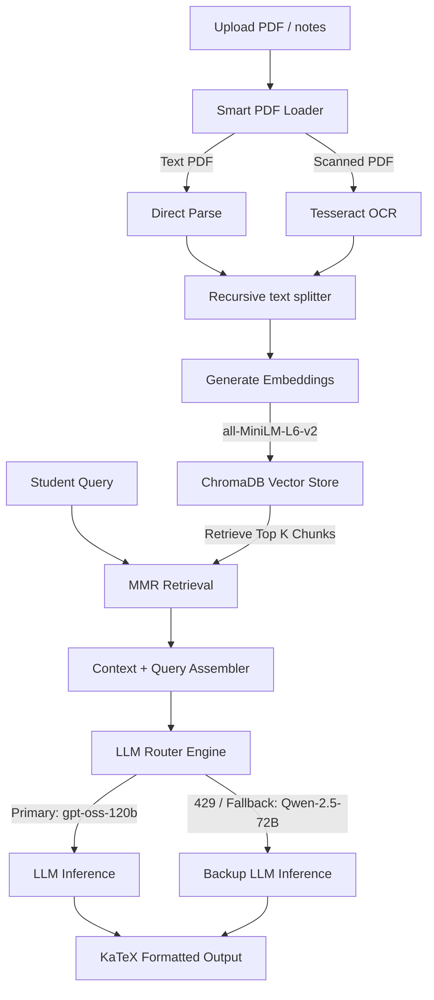

<div align="center">
  
  
  
  
  <br />
  
  <h1>🎓 UniMind — Smart RAG Study Assistant</h1>
  <p>An intelligent, production-grade Retrieval-Augmented Generation (RAG) assistant designed to index, query, and understand your university lecture notes and course material.</p>
</div>

<br />

---

## 🌟 Key Features

*   **⚡ Additive PDF Ingestion**: Upload documents via the UI or folder. The ingestion engine is fully idempotent and additive—it checks existing document metadatas in ChromaDB, skips duplicates, and appends only new course materials.
*   **👁️ Smart Multi-Format OCR**: Automatically detects scanned/image-only PDFs and routes them through a Tesseract OCR engine (via PyMuPDF & PIL) to extract text, while handling text-based PDFs natively with `pdfplumber`.
*   **🛡️ Resilient LLM Routing**: 
    *   Uses `openai/gpt-oss-120b` as the primary reasoning model.
    *   Includes **exponential backoff retries** to handle Hugging Face's serverless queue and traffic spikes.
    *   Features a **transparent fallback layer** that routes queries to `Qwen/Qwen2.5-72B-Instruct` if the primary service experiences downtime.
*   **💬 Context-Aware Stateless History**: Conversational flow is preserved dynamically across runs. Chat history is fed directly into the model as message pairs, ensuring clean state separation and preventing memory leaks or cross-session data bleeding.
*   **🎨 Premium Claude-inspired UI**: A clean, minimalist off-white/beige aesthetic (`#FAF9F7`) built using custom CSS injections, dynamic grid-based suggestion cards, and professional **Google Outfit** typography.
*   **📐 Math & LaTeX Support**: Fully formats mathematical equations (fractions, sub/superscripts, math syntax) from your lecture notes using an integrated KaTeX LaTeX block and inline parser.

---

## 🛠️ Architecture Workflow



---

## 📂 Project Architecture

*   `app.py` — The core Streamlit web application. Contains the premium UI, session state handlers, suggestion card integrations, and LaTeX rendering formatting.
*   `rag_chain.py` — Builds the Conversational Retrieval Chain, setups the LLM Router (GPT-OSS-120B with Qwen-72B fallback), and handles exponential backoff retry.
*   `ingest.py` — Coordinates document loading, chunks the text, embeds it using local sentence-transformers, and inserts chunks into the Chroma database.
*   `pdf_loader.py` — Text extraction wrapper. Inspects PDFs to distinguish text files from scans and applies PyMuPDF OCR fallback dynamically.
*   `config.py` — Global configuration parameters for models, pathing, and RAG chunk thresholds.

---

## 🔑 Environment Configuration

Create a `.env` file in the root directory to store your credentials:

```ini
# Hugging Face write-access token to authenticate with the Inference API
HUGGINGFACEHUB_API_TOKEN="your_hugging_face_token"
```

---

## 🚀 Local Deployment

Get UniMind up and running locally in seconds:

### 1. Installation

```bash
# Clone the repository
git clone https://github.com/abdullahks-devhub/rag-chatbot-university.git
cd rag-chatbot-university

# Create and activate virtual environment
python3 -m venv .venv
source .venv/bin/activate

# Install dependencies
pip install -r requirements.txt
```

### 2. File Indexing

Place your course notes (PDFs) into the `data/` folder and trigger the ingestion pipeline:

```bash
python ingest.py
```

### 3. Run Application

```bash
streamlit run app.py
```

Open `http://localhost:8501` to access your local UniMind interface.

---

## 🔗 Connect

*   **GitHub**: [github.com/abdullahks-devhub](https://github.com/abdullahks-devhub)
*   **HuggingFace Spaces**: [huggingface.co/spaces/AbdullahKS-Devhub](https://huggingface.co/spaces/AbdullahKS-Devhub)
