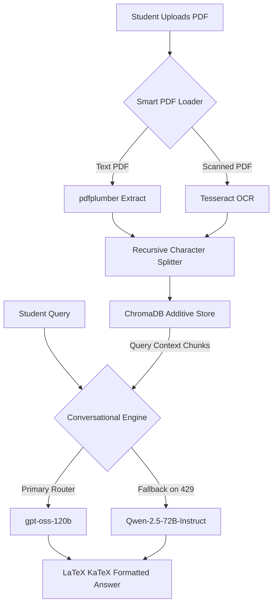

<div align="center">

# 🎓 UniMind — RAG University Study Assistant
### *Intelligent Document Querying. Additive Vector Indexing. Resilient LLM Routing.*

[](https://streamlit.io/)
[](https://python.org)
[](https://huggingface.co/spaces/AbdullahKS-Devhub/unimind-rag-chatbot)
[](https://langchain.com/)

<br/>

> **Upload your university lecture notes. Let AI index the context. Answer questions instantly.**

<br/>

🚀 **[Try the Live Demo →](https://huggingface.co/spaces/AbdullahKS-Devhub/unimind-rag-chatbot)**

</div>

---

## ✨ Features

- ⚡ **Additive PDF Ingestion** — Upload notes via the UI and only new documents get indexed, fully preserving your existing database chunks
- 👁️ **Smart Multi-Format OCR** — Auto-detects scanned documents, executing PyMuPDF & Tesseract OCR dynamically to extract text
- 🛡️ **Resilient LLM Routing** — Primary model `openai/gpt-oss-120b` features exponential backoff retries and falls back to `Qwen/Qwen2.5-72B-Instruct` on rate limits
- 💬 **Stateless Session History** — Maintains isolated, stateless memory channels per session to ensure zero data bleeding and high concurrency
- 🎨 **Premium Claude-Style UI** — Minimalist beige theme (`#FAF9F7`) with Outfit typography and interactive grid-based suggestion cards
- 📐 **LaTeX Math Support** — Formats mathematical equations, formulas, fractions, and symbols using an integrated KaTeX LaTeX block and inline parser
- 🌐 **Zero Setup for Users** — Fully deployed and pre-indexed on Hugging Face Spaces

---

## 🛠️ Tech Stack

| Layer | Technology |
|---|---|
| **Frontend** | Streamlit + Custom CSS (Premium Beige Theme) |
| **Orchestration** | LangChain (ConversationalRetrievalChain) |
| **Vector Database** | ChromaDB (MMR Retriever) |
| **LLM Inference Engine** | HF Router API (`openai/gpt-oss-120b` / `Qwen/Qwen2.5-72B-Instruct`) |
| **Embeddings Model** | HuggingFace sentence-transformers (`all-MiniLM-L6-v2`) |
| **PDF Extraction & OCR**| pdfplumber + PyMuPDF + Tesseract |
| **Environment Control** | Python Dotenv |
| **Deployment** | Hugging Face Spaces |

---

## 🧠 How It Works



---

## 📥 Ingestion Parameters

<details>
<summary>📐 <strong>Text Splitting Configuration</strong></summary>
<br/>

| Parameter | Type | Default Value | Description |
|---|---|---|---|
| **Chunk Size** | Integer | 1000 characters | Maximum size of each text segment |
| **Chunk Overlap** | Integer | 200 characters | Overlap size between consecutive chunks to preserve structural context |

</details>

<details>
<summary>🔍 <strong>Retrieval Constraints</strong></summary>
<br/>

| Parameter | Type | Default Value | Description |
|---|---|---|---|
| **Top K Chunks** | Integer | 5 | Number of relevant chunks retrieved from ChromaDB to construct prompt context |
| **Search Type** | String | `mmr` (Maximal Marginal Relevance) | Retrieval algorithm used to optimize relevance and reduce redundancy |

</details>

---

## 🚀 Run Locally

**1. Clone the repo**
```bash
git clone https://github.com/abdullahks-devhub/rag-chatbot-university.git
cd rag-chatbot-university
```

**2. Setup Virtual Environment & Dependencies**
```bash
python -m venv .venv
source .venv/bin/activate  # On Windows: .venv\Scripts\activate
pip install -r requirements.txt
```

**3. Configure Credentials**
Create a `.env` file in the root directory:
```ini
HUGGINGFACEHUB_API_TOKEN="your_huggingface_access_token"
```

**4. Index PDF Notes**
Place your lecture PDFs in the `data/` folder and build the database:
```bash
python ingest.py
```

**5. Start the Application**
```bash
streamlit run app.py
```
*The UI will launch on `http://localhost:8501`.*

---

## 📁 Project Structure

```text
.
├── data/                     # Raw PDFs directory (user-loaded lecture notes)
├── chroma_db/                # Persisted ChromaDB Vector Store
├── app.py                    # Main Streamlit web application & CSS layout
├── rag_chain.py              # LLM Routing, Retries, and RAG configuration
├── ingest.py                 # Document processing & ingestion coordinator
├── pdf_loader.py             # Smart multi-format PDF loader & OCR pipeline
├── config.py                 # Paths, models, and retrieval configuration
├── requirements.txt          # Python dependencies
└── packages.txt              # System level dependencies for Space environment
```

---

## ⚠️ Disclaimer

> This application is built **for educational and study assistance purposes only**.
> It is **not** a substitute for official university guidance, text books, or direct professor consultations.
> Always verify critical scientific formulas and details against official textbooks before exams.

---

<div align="center">

Made with ❤️ by **[Abdullah Khan](https://github.com/abdullahks-devhub)**

⭐ Star this repo if you found it useful!

</div>
